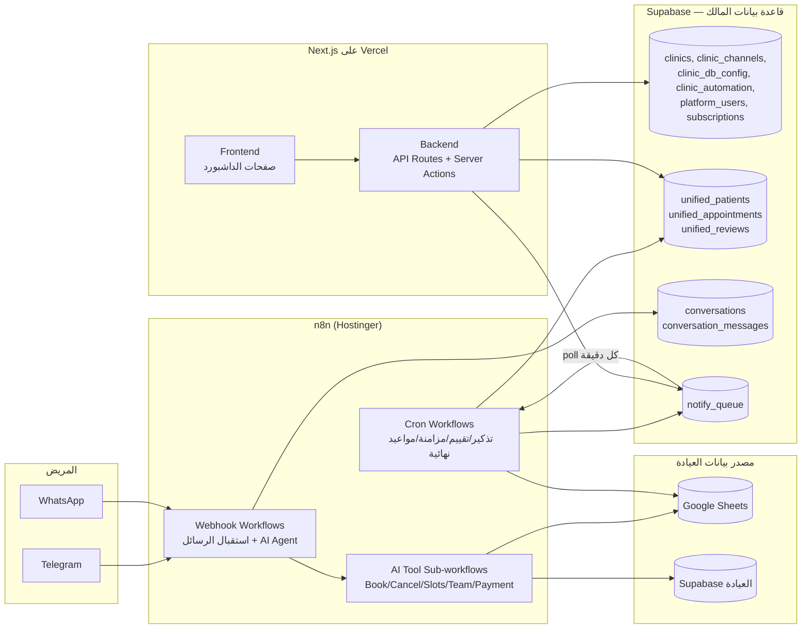

# MediSync AI — الدليل المعماري الكامل للفريق

> هذا الملف هو نقطة الدخول لأي مطوّر جديد (Frontend أو Backend أو Automation).
> يشرح المشروع كاملاً: المكوّنات، قواعد البيانات، n8n، عقود التكامل بينها،
> وخطة فصل الطبقات مستقبلاً (Frontend لحال / Backend لحال / n8n لحال).
> آخر تحديث: 2026-07-21.

---

## 1) ما هو المشروع؟

**MediSync AI** منصة SaaS متعددة العيادات (multi-tenant):

- **صاحب المنصة (Owner)** يسجّل العيادات من داشبورد إداري.
- **كل عيادة** تحصل على: داشبورد خاص + بوت ذكي على تيليجرام/واتساب يقوم بـ:
  1. تذكير المرضى بمواعيدهم.
  2. طلب تقييم بعد الزيارة (نجوم + تعليق).
  3. استقبال ذكي كامل: حجز/إلغاء/استعلام، عرض الأطباء والخدمات والأسعار،
     أوقات شاغرة حقيقية، تحصيل مقدّم مالي بصورة إثبات تُراجع من الداشبورد،
     وإمكانية استلام الموظف للمحادثة يدوياً.
- بيانات كل عيادة (مرضى/مواعيد/تقييمات) تعيش في **مصدر تختاره العيادة**:
  Google Sheets أو Supabase خاص بها (أو SQL Server مستقبلاً).

---

## 2) الـ Tech Stack

| الطبقة | التقنية | أين تعيش الآن |
|--------|---------|----------------|
| Frontend + Backend | **Next.js 16** (App Router, Server Components + API Routes) | هذا الريبو — منشور على **Vercel** |
| قاعدة بيانات المنصة | **Supabase (Postgres)** — المشروع `ylvowifrvhkgtvxllghg` | سحابة Supabase |
| الأتمتة والبوتات | **n8n self-hosted** | `https://n8n-quc4.srv1825882.hstgr.cloud` (Hostinger VPS) |
| الذكاء الاصطناعي | OpenAI (Chat + Whisper + Vision) | عبر n8n فقط — credential "MediSync OpenAI" |
| القنوات | Telegram Bot API، Twilio WhatsApp، Meta WhatsApp Cloud API | تُستدعى من n8n (ومن Next.js لرد الموظف فقط) |

**مبدأ ذهبي:** كل الأسرار طويلة العمر (توكنات القنوات، مفاتيح Google/OpenAI)
تعيش في n8n أو في قاعدة بيانات المالك — **الفرونت لا يرى أي سر أبداً**.

---

## 3) المعمارية العامة



**أهم قاعدة معمارية (اتُّخذت بعد مشاكل حقيقية في الإنتاج):**
الاتصال المباشر `Vercel → n8n` **غير موثوق** (طلبات كثيرة لا تصل).
لذلك أي أمر من الداشبورد لـ n8n يمر عبر **قاعدة البيانات كوسيط**
(نمط الطابور — انظر §7.3). الاتصال `n8n → Supabase` و `n8n → القنوات`
و `Vercel → Supabase` كلها موثوقة.

---

## 4) قاعدتا البيانات — لا تخلط بينهما أبداً

### 4.1 قاعدة بيانات المالك (Owner Supabase) — بيانات المنصة
عملاء الاتصال في الكود: `src/lib/supabase/{client,server,admin}.ts`

| الجدول | وظيفته |
|--------|--------|
| `clinics` | سجل العيادات (الاسم، الطبيب، التخصص، العنوان، الحالة) |
| `clinic_channels` | قنوات كل عيادة + توكناتها (tg_bot_token، twilio_*، wa_*) |
| `clinic_db_config` | نوع مصدر بيانات العيادة (google_sheets / supabase / sql_server) + إعداداته |
| `clinic_automation` | إعدادات الأتمتة: ساعات العمل، نص التذكير/التقييم، `deposit_enabled`، `deposit_amount`، `deposit_deadline_hours` |
| `clinic_payment_methods` | طرق الدفع المعروضة في البوت (فودافون كاش…) |
| `platform_users` | كل حسابات الدخول: المالك (`clinic_id = NULL`) وموظفو العيادات (مدير/طبيب/سكرتير) + دوامهم + `notify_chat_id` لتنبيهات تيليجرام |
| `subscriptions` | اشتراك كل عيادة (الباقة، تاريخ الانتهاء) |
| `clinics_config` (**view**) | تجميعة جاهزة لكل إعدادات العيادة — **هذا ما تقرأه n8n workflows** بدل join يدوي |
| `unified_patients / unified_appointments / unified_reviews` | **مرآة موحّدة** لبيانات كل العيادات مهما كان مصدرها — **هي مصدر قراءة الداشبورد الوحيد** |
| `conversations` + `conversation_messages` | كل محادثات البوت (وارد/صادر) لعرضها في صندوق الوارد + وضع `mode: ai/human` |
| `notify_queue` | طابور رسائل للمرضى (قرارات الدفع، تذكير المقدّم، الإلغاء التلقائي) — يكتبه Backend وتوصله n8n |
| `sync_state`, `column_mappings`, `ai_insights`, `n8n_execution_log`, `wa_sessions` | حالة المزامنة، خرائط أعمدة الشيت، ملخصات AI اليومية، سجلات، جلسات المحادثة |

Migrations: `supabase/migrations/*.sql` — تُنفَّذ بترتيب اسم الملف.

### 4.2 قاعدة بيانات العيادة (لكل عيادة على حدة)
Adapters: `lib/db-adapters/*`

- **Google Sheets**: تبويبات Appointments / Reviews / Services / Absences / Employees.
  لا يقرأها Next.js مباشرة أبداً (مفتاح Google عند n8n فقط).
- **Supabase العيادة**: `supabase/clinic-schema.sql` — يقرؤها Next.js مباشرة.
- **SQL Server**: غير مبني بعد (stub تحقق من الإعدادات فقط).

### 4.3 طبقة التوحيد (Unified Layer) — قلب النظام
- **Import**: n8n كل 15 دقيقة تقرأ مصدر العيادة وتصب في `unified_*`
  (مع AI mapping لأسماء الأعمدة، cached في `column_mappings`).
- **Export**: n8n كل 5 دقائق تدفع الصفوف `sync_status='pending_out'`
  من `unified_*` رجوعاً للشيت.
- **قاعدة التعارض**: الداشبورد يكسب — الصف `pending_out` لا يُداس من الشيت.
- الحقول المهمة في `unified_appointments` لفريق الباك:
  `payment_status (none/pending/paid/rejected)`, `payment_proof_url`,
  `deposit_amount`, `deposit_due_at`, `payment_reminder_sent_at`,
  `staff_alerted_at`, `payment_alerted_at`, `origin`, `sync_status`, `raw` (JSONB).

---

## 5) المصادقة والأدوار

- Supabase Auth (email/password) → `platform_users` يحدد الدور.
- `owner` → `/admin/*` | `manager/doctor/secretary` → `/clinic/[clinicId]/*` مقيّد بعيادته.
- الحماية **ثلاث طبقات** — لا تعتمد على واحدة فقط:
  1. `src/proxy.ts` (مستوى الـ route).
  2. إعادة تحقق server-side في كل `layout.tsx`.
  3. كل API mutation يستدعي `requireOwner()` / `requireClinicMember()` /
     `requireClinicManagerOrOwner()` من `lib/auth/*`.
- `SUPABASE_SERVICE_ROLE_KEY` يُستخدم فقط في `lib/supabase/admin.ts` (server-only).
- RLS مفعّل على كل جداول المالك؛ جداول الطوابير والـ RPCs الحساسة `service_role` فقط.

---

## 6) n8n — كتالوج الـ Workflows الكامل

> Instance: `https://n8n-quc4.srv1825882.hstgr.cloud`
> Credentials داخلها: "MediSync Owner Supabase" (supabaseApi)، "MediSync Google Sheets"، "MediSync OpenAI".
> **كل الـ workflows مربوطة بـ Error Workflow مركزي** يرسل تيليجرام للمالك عند أي فشل.

### 6.1 استقبال الرسائل (Webhooks)
| Workflow | ID | الوظيفة |
|---|---|---|
| MediSync — Telegram Webhook | `LnrJcropqzAsc2Z5` | كل رسائل تيليجرام لكل العيادات (مسار واحد + `?token=` لتمييز البوت). يشمل: ربط رقم المريض بجهة الاتصال، تدفق التقييم، AI Agent، صوت (Whisper)، صور (Vision + رفع إثبات الدفع للـ Storage)، أزرار الموظفين (تأكيد/رفض الدفع، إلغاء الموعد)، تسجيل المحادثات، **بوابة mode=human** (البوت يسكت عند استلام الموظف) |
| MediSync — Twilio WhatsApp Webhook | `LhVhhBwpqmyG7uNt` | نفس الشيء لواتساب Twilio (هوية المريض = رقم المرسل) |
| MediSync — WhatsApp Webhook (Meta) | `AbBfA3I5l02LXTxW` | مسار Meta الرسمي — جاهز لكن بانتظار اعتماد القوالب |

### 6.2 أدوات الـ AI (Sub-workflows يستدعيها الـ Agent)
| Workflow | ID | ملاحظات أمان |
|---|---|---|
| AI Tool: Get Clinic Team | `8v1Wau1PSagcXvBX` | الأطباء (بجداول دوامهم من `platform_users`) + الخدمات والأسعار من مصدر العيادة |
| AI Tool: Get Available Slots | `1C2tTqONnZv4WZ6W` | الأوقات الشاغرة فعلياً ليوم/نافذة |
| AI Tool: Get Appointments | `R2D28EFk8zqmeazc` | **رقم المريض مربوط بهوية المحادثة — لا يُمرَّر من نص المستخدم أبداً** (خصوصية) |
| AI Tool: Book Appointment | `DaCr5jmy23jbJQkh` | تحقق ساعات العمل + التعارض، يكتب للمصدر + مرآة `unified` |
| AI Tool: Cancel Appointment | `VbuvCThBhavwNt5V` | نفس قيد الهوية |
| AI Tool: Record Payment | `Qha418EWAReDHAzt` | يستدعي RPC `record_payment_pending` → `payment_status='pending'` |
| AI Tool: Transfer to Staff | `SSsrDo8IhQP9y83K` | تصعيد للموظفين |

### 6.3 الجدولات (Crons)
| Workflow | ID | التكرار | الوظيفة |
|---|---|---|---|
| Appointment Reminders | `yuNXRR6dZzL4I1V6` | 5 د | التذكير قبل الموعد (بمتغيرات العيادة + أزرار تيليجرام) |
| Post-Visit Rating Requests | `aPwJWU2Tj2gB3cta` | 15 د | طلب التقييم بعد الزيارة |
| Sync Import (Sheets → Unified) | `n3xasiAc4Z5aKh0M` | 15 د | مواعيد + مرضى |
| Sync Import Reviews | `pG9WkXiGi1J2yY89` | 15 د | تقييمات |
| Sync Import Employees | `zuwR3UgptaBV5mSy` | **2 د** + webhook فوري | تبويب Employees → `platform_users` |
| Sync Export (Unified → Sheets) | `kqd0xNTcZWjAjpsz` | 5 د | دفع `pending_out` للشيت |
| Staff Alerts (Bookings + Payments) | `TNylNux47hoCn0jf` | 2 د | DM للموظفين عند حجز جديد/إثبات دفع (مع أزرار تأكيد/رفض) |
| Telegram Webhook Auto-Register | `F65m69j79mbWRP1R` | 2 د | ضمان تسجيل webhook كل بوت (self-healing) |
| **Payment Review Notify (Worker)** | `OVXqu45heCOz4JVe` | **1 د** + webhook poke | **عامل الطابور**: يسحب من `notify_queue` ويرسل للمريض على قناته (يفرّغ الطابور كاملاً بحلقة) |
| **Payment Deadline (Auto-Cancel)** | `xTo25bgdRlKu2Hfe` | 10 د | RPC `payment_deadline_tick()`: مهلة المقدّم → تذكير قبل ساعة → إلغاء تلقائي |
| AI Insights | `rohZyyXdpVo5gHKL` | يومي 06:00 | ملخص عربي يومي لكل عيادة في `ai_insights` |
| Error Alert (Owner Telegram) | `3Zw5nueoz7iJUdXc` | عند أي فشل | تنبيه المالك فوراً باسم الـ workflow والعقدة والخطأ |

### 6.4 واجهات بيانات لـ Next.js (Static Webhooks بسر مشترك)
| Workflow | ID | Endpoint | الاستخدام |
|---|---|---|---|
| Data Read API | `4eIGIWz0pA72cqsJ` | `POST /webhook/data-read` | قراءة Appointments/Reviews/Services/Absences لعيادات الشيت |
| Data Write API | `ab7tAsyrDtcaTCX9` | `POST /webhook/data-write` | كتابة موعد / تغيير حالة لعيادات الشيت |
| Services Write API | `86I98DN4hcWxDEKI` | `POST /webhook/services-write` | كتابة الخدمات/الغياب (معزول عن مسار المواعيد) |
| Verify Google Sheet | `mYvfZlvgDUTd1nBW` | webhook | فحص صلاحية الشيت أثناء الـ wizard |

---

## 7) عقود التكامل بين الطبقات (Integration Contracts)

> **هذا هو القسم الأهم لفريق يريد فصل الطبقات** — هذه هي الحدود الفعلية.

### 7.1 Frontend → Backend
- الفرونت (صفحات + مكونات client) يتكلم **فقط** مع API Routes الداخلية
  و Server Actions. لا يتصل بـ Supabase admin ولا n8n ولا القنوات مباشرة.
- القائمة الكاملة للـ API الحالية:
```
POST  /api/clinics                    إنشاء عيادة (wizard)
GET/PATCH/DELETE /api/clinics/[id]
POST  /api/clinic-channels            حفظ قنوات العيادة
POST  /api/clinic-db (+/test)         حفظ مصدر البيانات (+ يستدعي مزامنة الموظفين الفورية)
POST  /api/clinic-automation          إعدادات الأتمتة
POST  /api/subscriptions
GET   /api/n8n/status                 حالة n8n للوحة الأدمن
POST  /api/telegram/test, /api/whatsapp/test
GET/POST /api/clinic/[clinicId]/channels          (+ register-webhook, channel-health, test-alert)
GET/POST/PATCH/DELETE /api/clinic/[clinicId]/payment-methods[/methodId]
PATCH /api/clinic/[clinicId]/payments/[apptId]    قرار مراجعة الدفع {status, note?}
GET   /api/clinics/[id]/conversations             (+ /attention-count)
GET   /api/clinics/[id]/conversations/[convId]/messages
POST  /api/clinics/[id]/conversations/[convId]/mode    {mode: 'ai'|'human'}
POST  /api/clinics/[id]/conversations/[convId]/reply   {text} — رد الموظف
GET/POST/PATCH/DELETE /api/clinics/[id]/staff[/staffId]
POST  /api/clinics/[id]/suspend
```

### 7.2 Backend → n8n (القاعدة: عبر قاعدة البيانات، لا HTTP مباشر)
| الحاجة | الآلية |
|---|---|
| إشعار المريض بقرار دفع / أي رسالة نظامية | **INSERT في `notify_queue`** + (اختياري) poke على `POST /webhook/7c2e9f4a-payment-review-notify` — الـ poke تسريع فقط، الطابور هو الضمان |
| مزامنة موظفين فورية بعد تسجيل عيادة شيت | poke على `POST /webhook/c4a1f8d2-sync-employees` — والـ cron كل دقيقتين هو الضمان |
| قراءة/كتابة بيانات عيادة شيت | `POST /webhook/data-read` / `data-write` / `services-write` مع `{secret: MEDISYNC_N8N_READ_SECRET}` في الـ body |
| حالة n8n للوحة الأدمن | n8n REST API (`N8N_BASE_URL` + `N8N_API_KEY`) — قراءة فقط |

> ⚠️ **درس إنتاج مهم:** طلبات `Vercel → n8n` أثبتت أنها لا تصل أحياناً
> (تحققنا منها بسجلات التنفيذ). لهذا **أي عملية حرجة يجب أن يكون ضمانها
> صف في قاعدة البيانات يلتقطه cron خلال 1–2 دقيقة**، والـ HTTP المباشر
> مجرد تسريع اختياري. طبّق نفس النمط على أي تكامل جديد.

### 7.3 نمط الطابور (`notify_queue`) — العقد الكامل
```
INSERT notify_queue (clinic_id, appointment_id, decision, note)
  decision ∈ {paid, rejected, deposit_reminder, deposit_cancelled}
→ العامل (كل دقيقة أو poke):
  1. Get Next Job:  أقدم صف sent_at IS NULL
  2. Claim Job:     PATCH ... WHERE sent_at IS NULL  (ذرّي — يمنع الإرسال المزدوج)
  3. يجيب إعدادات العيادة من clinics_config + الموعد + محادثات العيادة
  4. يطابق هاتف الموعد مع محادثة (آخر 9 أرقام) → يرسل على قناتها بمفاتيح العيادة
  5. يسجل الرسالة في conversation_messages ويحدّث المحادثة
  6. Save Result:   result JSONB على الصف ثم يلف على الصف التالي حتى يفرغ الطابور
```

### 7.4 n8n → مصادر بيانات العيادات
- كل workflow يتفرع على `db_type` من `clinics_config`.
- Google: credential واحد للمالك (الشيتات مشاركة معه). Supabase العيادة:
  `sb_project_url + sb_service_key` من إعدادات العيادة.

### 7.5 القنوات — من يرسل ماذا؟
| المرسل | متى |
|---|---|
| n8n | كل رسائل البوت والتذكيرات والتقييمات وتنبيهات الموظفين ورسائل الطابور |
| Next.js (`lib/messaging/send.ts`) | حالة واحدة فقط: **رد الموظف اليدوي** من صندوق المحادثات (تيليجرام / Twilio / Meta مدعومة كلها) |
| هوية الويبهوك | تيليجرام: مسار ثابت + `?token=`؛ Twilio: مسار ثابت `d9e8f7a6-twilio-whatsapp`؛ Meta: مسار لكل عيادة بـ `wa_verify_token` |

---

## 8) متغيرات البيئة (Vercel)

| المتغير | من يستخدمه | ملاحظات |
|---|---|---|
| `NEXT_PUBLIC_SUPABASE_URL` / `NEXT_PUBLIC_SUPABASE_ANON_KEY` | الفرونت والسيرفر | مشروع المالك |
| `SUPABASE_SERVICE_ROLE_KEY` | **server فقط** (`lib/supabase/admin.ts`) | لا يوضع بـ NEXT_PUBLIC أبداً |
| `NEXT_PUBLIC_N8N_WEBHOOK_BASE_URL` | السيرفر | أساس روابط الـ webhooks (له default محشور للـ instance الحالي) |
| `TELEGRAM_N8N_WEBHOOK_PATH` | السيرفر | مسار ويبهوك تيليجرام إن تغيّر |
| `MEDISYNC_N8N_READ_SECRET` | السيرفر | السر المشترك مع Data Read/Write APIs |
| `N8N_BASE_URL` / `N8N_API_KEY` | السيرفر | n8n REST API (صفحة حالة الأدمن) |
| `META_GRAPH_URL` | السيرفر | override اختياري لـ Graph API |

---

## 9) خطة الفصل المستقبلي (Frontend / Backend / n8n)

الوضع الحالي: الفرونت والباك في تطبيق Next.js واحد، و n8n منفصلة أصلاً.
**الحدود مرسومة بحيث يكون الفصل ميكانيكياً، ليس إعادة كتابة:**

### المرحلة 0 (الوضع الحالي — الحدود محترمة)
- الفرونت لا يلمس إلا API الداخلية (§7.1) → أي فصل لاحق لن يغيّر المكونات.
- الباك لا يتصل بـ n8n إلا عبر العقود في (§7.2) → استبدال n8n instance
  أو نقلها لا يمس الفرونت إطلاقاً.

### المرحلة 1 — فصل الباك كخدمة مستقلة
1. انقل مجلد `src/app/api/**` + `src/lib/{supabase,auth,messaging,n8n,db-adapters,clinic-*}`
   إلى خدمة مستقلة (NestJS/Fastify/Next API-only — لا فرق، المنطق منقول كما هو).
2. الفرونت يحتاج تغييراً واحداً: `API_BASE_URL` بدل المسارات النسبية + تمرير
   جلسة Supabase (Bearer token) بدل الكوكي المشتركة.
3. المصادقة تبقى Supabase Auth نفسها — الخدمة الجديدة تتحقق من الـ JWT
   بنفس منطق `lib/auth/*` (المنطق موجود وجاهز للنقل).
4. **لا شيء يتغير في n8n ولا في قاعدة البيانات.**

### المرحلة 2 — عزل n8n كطبقة قابلة للاستبدال
- كل تكاملات n8n محصورة في: 4 مسارات webhook (§6.4) + طابور `notify_queue`
  + جداول المزامنة. أي بديل (خدمة workers خاصة) يجب أن يطبّق نفس العقود فقط.
- لتبديل الـ instance: غيّر `NEXT_PUBLIC_N8N_WEBHOOK_BASE_URL` و `N8N_BASE_URL`
  واستورد الـ workflows (كلها قابلة للتصدير من n8n).

### المرحلة 3 — قواعد لأي خدمة جديدة
1. الفرونت لا يتصل إلا بالـ Backend API.
2. أي أمر حرج من الباك لأي طرف خارجي = صف في جدول طابور + cron يضمنه.
3. الأسرار في n8n أو قاعدة المالك فقط.
4. كل قراءة داشبورد من `unified_*` — ممنوع ربط صفحة بمصدر عيادة مباشرة.

---

## 10) أنماط ودروس إنتاج (Gotchas) — اقرأها قبل ما تلمس n8n

1. **Vercel→n8n لا يوصل أحياناً** → استخدم نمط الطابور دائماً (§7.2/7.3).
2. **httpRequest + RPC يرجع نص scalar** → فعّل `responseFormat: text` واقرأ
   `$json.data`، وإلا يفشل الـ parse رغم أن الرد سليم.
3. **صور تيليجرام** ترجع `mimeType: application/octet-stream` — عقدة
   `Fix Image MIME` تفرض `image/jpeg` قبل OpenAI Vision، لا تحذفها.
4. **n8n SDK**: `setNodeParameter` بمسار نسبي لـ `parameters`
   (`/url` وليس `/parameters/url`)، والاعتمادات لا تُسند تلقائياً للعقد
   الجديدة — دائماً `setNodeCredential` بعد الإضافة.
5. **التواريخ**: أي عرض وقت في الداشبورد يجب أن يثبّت
   `timeZone: "Asia/Riyadh"` (استخدم `src/lib/format.ts`).
6. **هوية المريض في البوت** = حساب المحادثة (جهة اتصال تيليجرام / رقم واتساب).
   **ممنوع** تمرير رقم هاتف من نص المستخدم لأي أداة — هذه ثغرة خصوصية أُغلقت.
7. **ترتيب التنفيذ في n8n (v1)**: الفروع المتوازية تنفَّذ بالترتيب — إذا احتجت
   ناتج عقدة في فرع آخر، اربطها سلسلة (كما فُعل مع Upsert Conversation قبل بوابة الـ AI).
8. عمود `mode` في `conversations` لا يُكتب من مسار الرسائل الواردة —
   حتى لا يُداس استلام الموظف.

---

## 11) التشغيل والنشر

- **تطوير محلي**: `npm install && npm run dev` مع `.env.local` يحوي متغيرات §8.
  (بدون n8n محلية: عيادات Supabase تعمل كاملة؛ ميزات الشيت تحتاج الـ instance الحقيقية).
- **فحوص قبل أي دمج**: `npx tsc --noEmit && npm run lint && npm run build`.
- **النشر**: push إلى `main` → Vercel ينشر تلقائياً.
- **Migrations**: أضف ملفاً في `supabase/migrations/` بنفس ترتيب التسمية
  وطبّقه على مشروع المالك (النسخة الحية تُطبَّق عبر Supabase MCP/CLI).
- **تعديل n8n**: عدّل → `publish` → جرّب بتنفيذ حقيقي وتحقق من النتيجة في
  قاعدة البيانات — القاعدة في هذا المشروع: **لا ميزة تُعتبر منجزة بدون
  تنفيذ حي متحقق منه**.

---

## 12) ملفات مرجعية أخرى
- `CLAUDE.md` — سياق المشروع المضغوط وقراراته التاريخية.
- `docs/PROJECT_REQUIREMENTS_STATUS.md` — حالة المتطلبات وخطة الأولويات.
- `README.md` — الانحرافات المقصودة عن المواصفة الأصلية.
